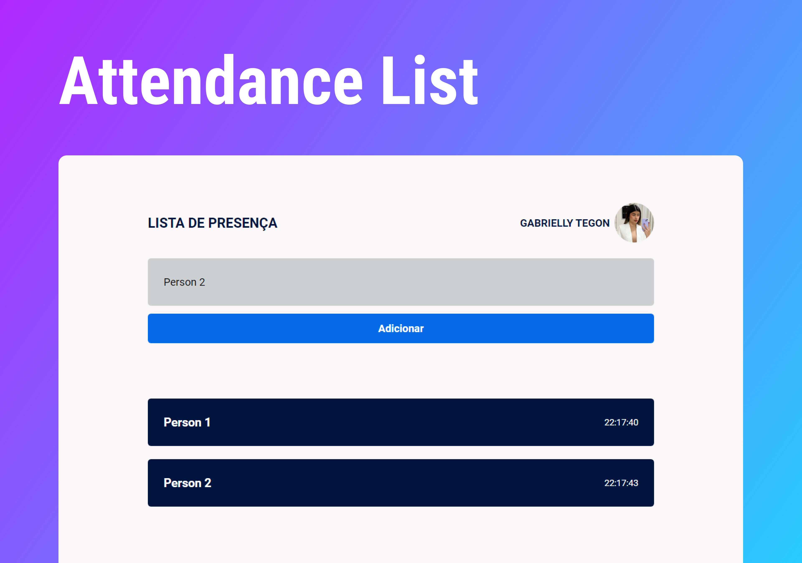

<h1 align="center"> Attendance List </h1>

 Projeto realizado durante o curso Discover oferecido pela Rocketseat no módulo de ReactJS.  

  <a href="#-tecnologias">Tecnologias</a>&nbsp;&nbsp;&nbsp;|&nbsp;&nbsp;&nbsp;
  <a href="#-projeto">Projeto</a>

  

 

  

## 🚀 Tecnologias

Esse projeto foi desenvolvido com as seguintes tecnologias:

- HTML
- CSS
- ReactJS
- API do GitHub
- JavaScript

## 💻 Projeto

O Attendance List é uma aplicação de controle de presença, seja de um evento ou até mesmo de uma aula. 

---